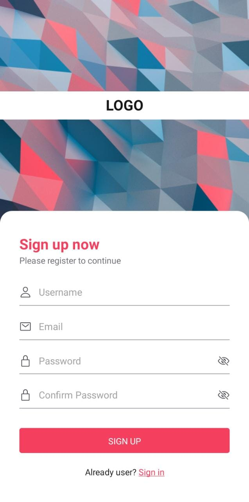

# Chat Realtime with React Native and Firebase

## Pré-requisitos

 - Ter um projeto [Firebase](https://console.firebase.google.com/) configurado.
 - Ter o [Expo Go](https://expo.dev/expo-go) instalado.
 - Ter o [NodeJS](https://nodejs.org/) instalado.

## Instalando

Para instalar, execute o seguinte comando na pasta do projeto:

```js
    npm install
```

## Executando o projeto

Para rodar o projeto execute o seguinte comando na pasta do projeto:

```js
    npx expo start
```

Basta lê o QrCode gerado atraves do aplicativo do Expo Go instalado em seu smartphone.

## Resultado
 <p align="center">
  
  
 </p>
 
 <p align="center">
  
  
 </p>

## Valeu pela visita! 😉
